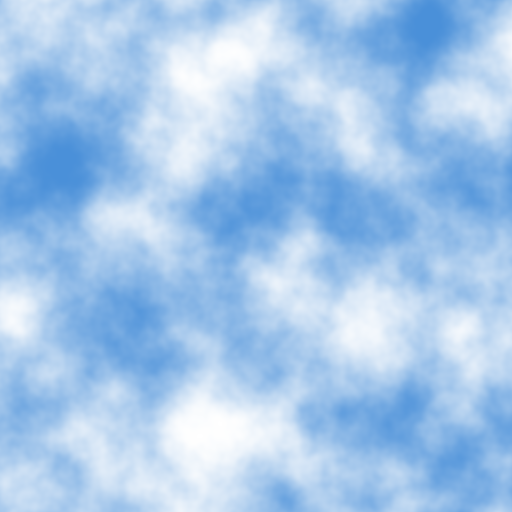
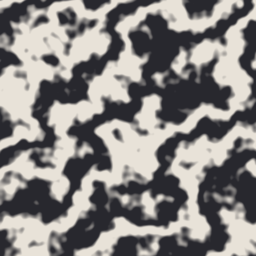
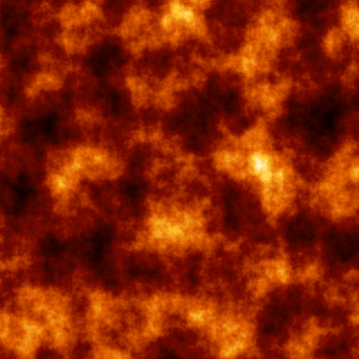
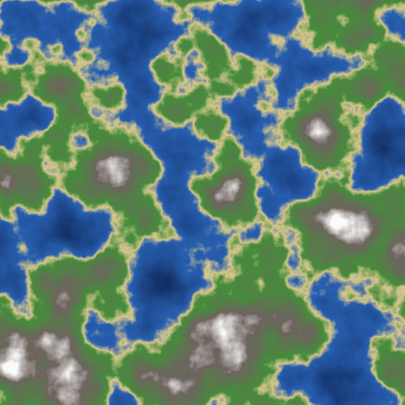
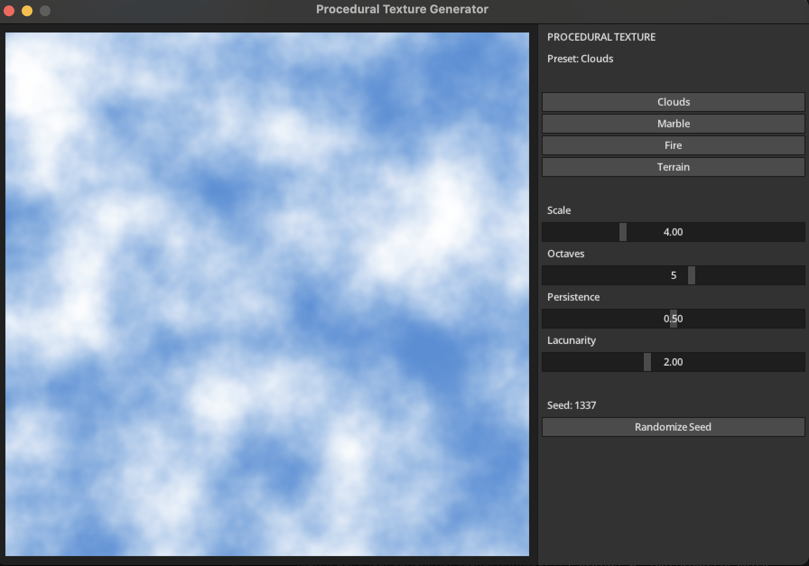
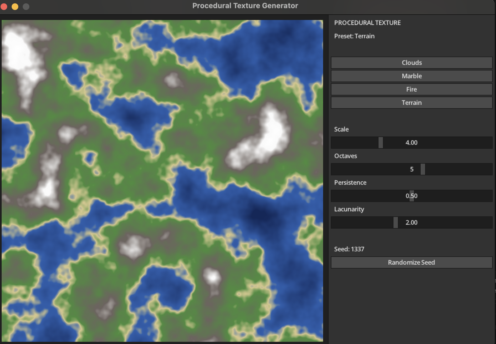

# Interactive Procedural Texture Generator

A small C++ tool that generates textures from Classic Perlin Noise: no image
files are stored anywhere, every pixel is computed from the noise function at
render time. The same underlying noise field drives four different-looking
materials — Clouds, Marble, Fire, and Terrain — purely by changing how the
noise value is mapped to color. Scale, octaves, persistence, lacunarity, and
seed are all live sliders — dragging one regenerates the texture immediately.

## How it works

1. **Gradient grid.** A pseudo-random gradient vector is assigned to each
   integer lattice point (`PerlinNoise` builds this from a permutation table
   seeded by the user).
2. **Per-pixel sampling.** For a given `(x, y)`, the four surrounding lattice
   points are found, the dot product between each corner's gradient and the
   offset vector to `(x, y)` is computed, and the four results are blended
   with a smooth (fade) interpolation — this is what gives Perlin Noise its
   organic, non-random-looking transitions.
3. **Fractal sum (fBm).** Several octaves of that noise are summed at
   increasing frequency and decreasing amplitude (`persistence`,
   `lacunarity`) to add fine detail on top of the broad shape.
4. **Shading.** The resulting scalar field is remapped to color differently
   per preset: a two-color gradient for clouds, a sine-warped vein pattern
   for marble, a multi-stop fire ramp, and elevation bands for terrain.
5. **UI.** A MiniFB window shows the live texture; a microui panel on the
   right exposes Scale / Octaves / Persistence / Lacunarity sliders, a
   preset picker, and a seed randomizer. Any change regenerates the texture
   that frame.

## Building

```sh
cmake -S . -B build -DCMAKE_BUILD_TYPE=Release
cmake --build build -j
```

Dependencies (`stb`, MiniFB, microui) are fetched automatically via CMake's
`FetchContent` — no manual vendoring required.

## Running

Interactive window:

```sh
./build/perlin_noise
```

Headless preview export (writes PNGs, used for `screenshots/`):

```sh
./build/perlin_noise --export screenshots
```

## Preview

| Preset | |
|---|---|
| Clouds |  |
| Marble |  |
| Fire |  |
| Terrain |  |

### Interactive app

| Default | After picking Terrain |
|---|---|
|  |  |
