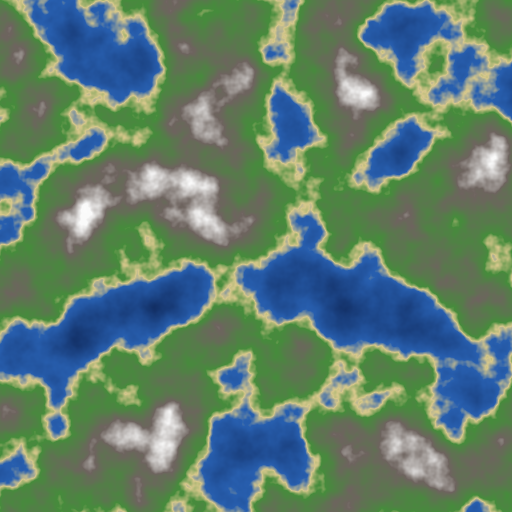
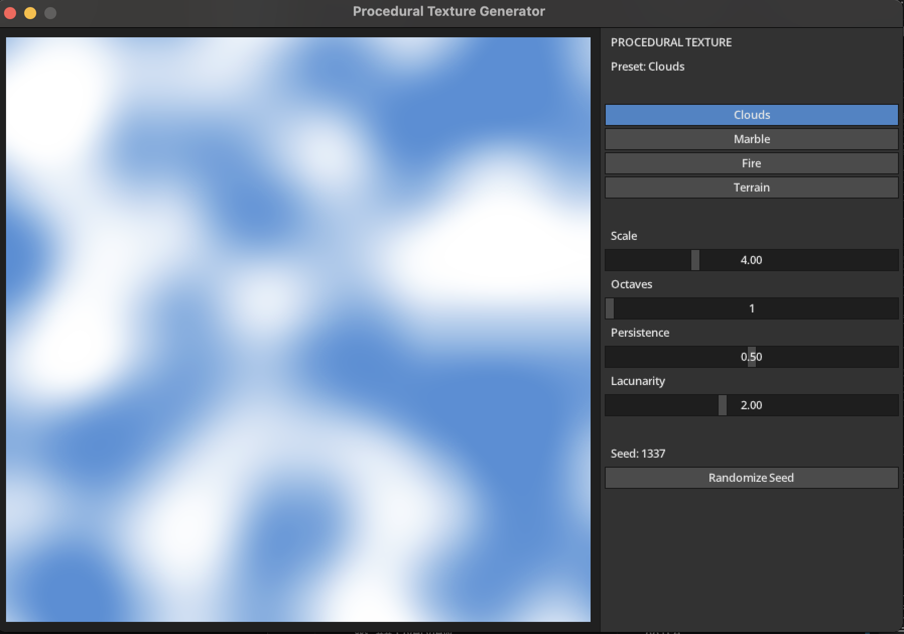
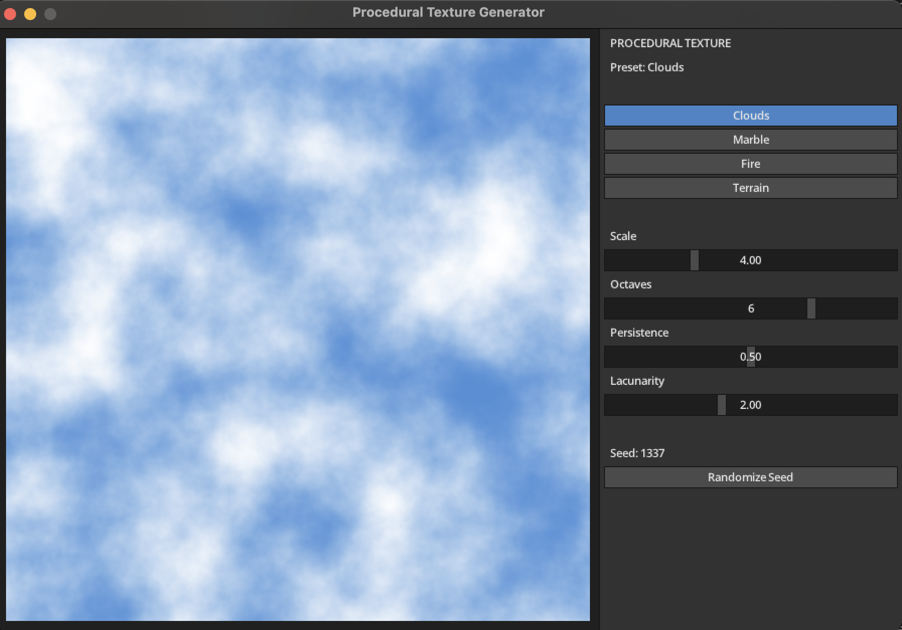
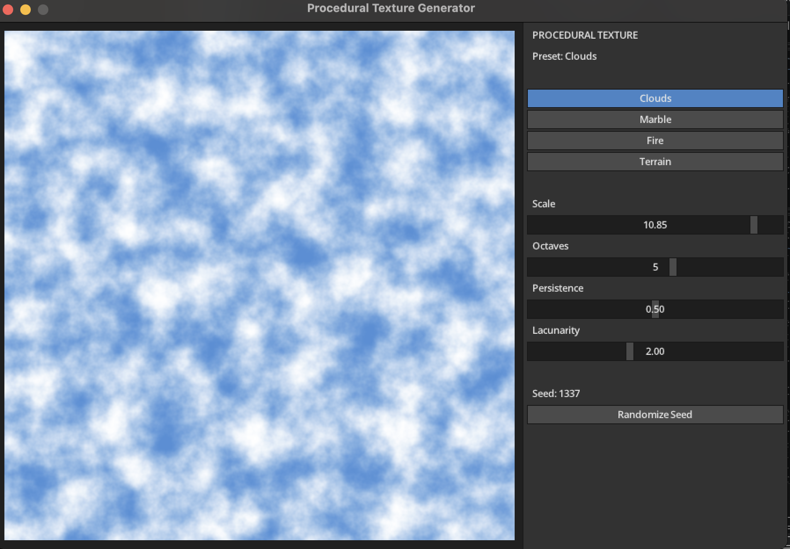
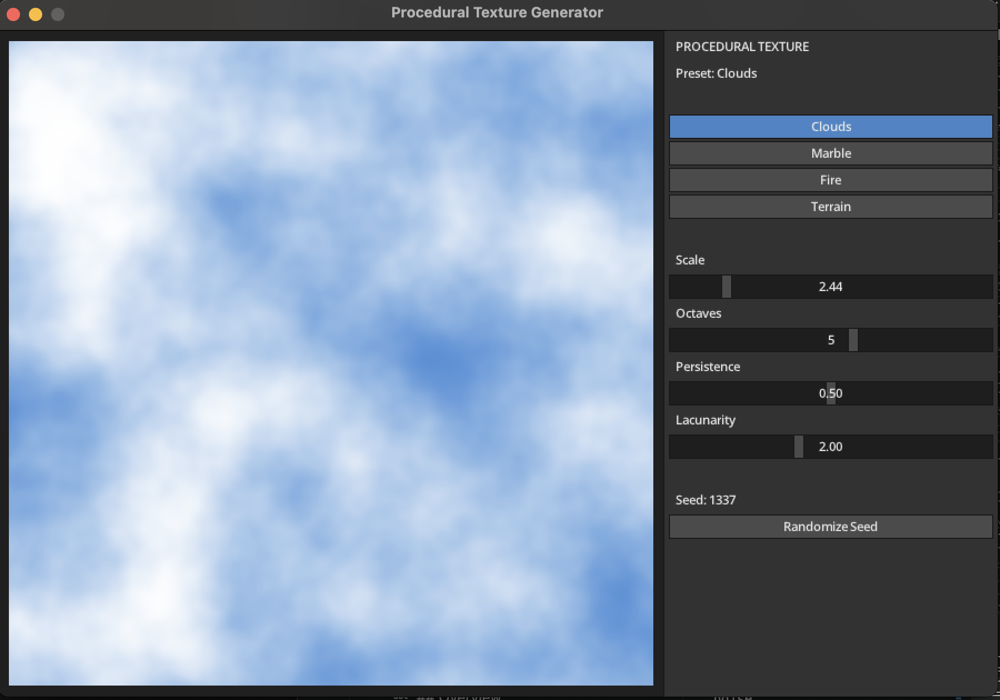

# Interactive Procedural Texture Generator — Free Project Report

## Overview

For this project, I built an interactive C++ application that generates procedural textures using Perlin Noise. The textures are generated at runtime instead of being loaded from image files.

The application includes four presets: **Clouds**, **Marble**, **Fire**, and **Terrain**. All four use the same Perlin Noise implementation, but each preset converts the generated noise values into colors in a different way.

The program can be used in two modes. The first is an export mode that generates PNG previews without opening a window. The second is an interactive application built with MiniFB and `microui`. In the interactive version, the user can change the Scale, Octaves, Persistence, Lacunarity, preset, and random seed and see the texture update immediately.

---

## Perlin Noise

I implemented a 2D Perlin Noise generator in C++. It uses a permutation table generated from a seed. Using the same seed produces the same noise pattern, while changing the seed creates a different one.

For each point `(x, y)`, the algorithm finds the four lattice points surrounding it. Each corner has a pseudo-random gradient direction. I calculate the dot product between the gradient at each corner and the offset from that corner to the sample point.

The four results are then interpolated using a quintic fade function. This interpolation is what gives Perlin Noise its smooth transitions. If the values at nearby points were completely independent, the result would have much sharper and less natural changes.

I also implemented fractal noise by combining several octaves. Each octave samples the noise at a higher frequency and with a lower amplitude. `Persistence` controls how much the later octaves contribute to the final result, while `Lacunarity` controls how quickly the frequency increases from one octave to the next.

---

## Texture Presets

After generating the noise value, I convert it to a color according to the selected preset.

Before applying the color mapping, the noise value is normalized to a suitable range. I also apply a contrast adjustment because the generated values usually stay relatively close to the middle of the theoretical range. Without this adjustment, some of the textures looked too flat and the differences between regions were less visible.

The presets are implemented as follows:

* **Clouds** use a blend between sky blue and white. A smooth transition is applied so that the clouds do not look like a simple linear gradient.
* **Marble** uses the noise to distort a sine pattern. This creates irregular bands that resemble marble veins.
* **Fire** uses a color ramp that goes from near-black through red, orange, and yellow to a pale highlight. The mapping is adjusted so that only a small part of the image reaches the brightest colors.
* **Terrain** treats the noise value as an elevation. Different ranges are mapped to deep water, shallow water, sand, grass, rock, and snow.

### Preset Results

The screenshots below were generated using the export mode. I used fixed parameters for each preset so that the same results can be reproduced.

| Preset  | Scale | Octaves | Persistence | Lacunarity | Seed |
| ------- | ----: | ------: | ----------: | ---------: | ---: |
| Clouds  |   4.0 |       5 |        0.50 |        2.0 |    7 |
| Marble  |   3.0 |       4 |        0.55 |        2.2 |   42 |
| Fire    |   5.0 |       6 |        0.60 |        2.0 |   99 |
| Terrain |   4.0 |       6 |        0.50 |        2.0 |    5 |

| Clouds                                            | Marble                                          |
| ------------------------------------------------- | ----------------------------------------------- |
|  |  |

| Fire                                       | Terrain                                           |
| ------------------------------------------ | ------------------------------------------------- |
|  |  |

### Changing the Seed

I also compared the Terrain preset using two different seeds while keeping all the other parameters unchanged.

Both examples use the same Scale, Octaves, Persistence, Lacunarity, elevation thresholds, and color mapping. Only the seed changes. Since the seed controls the gradient pattern used by the Perlin Noise generator, the locations of the water, land, and higher regions change even though the terrain settings remain the same.

| Seed 5                                                   | Seed 123                                             |
| -------------------------------------------------------- | ---------------------------------------------------- |
|  |  |

---

## Interactive Application

The interactive version uses a fixed 900×600 MiniFB window. The generated texture is displayed on the left side and the control panel is displayed on the right.

The interface was built using `microui`. It contains buttons for selecting the preset and sliders for Scale, Octaves, Persistence, and Lacunarity. There is also a button for generating a new random seed.

Whenever one of these values changes, the texture is regenerated. This makes it possible to see the effect of each parameter directly while the application is running.

MiniFB provides the window, framebuffer, and input information. I connected the MiniFB input to `microui` so that the interface can respond correctly to mouse, keyboard, and text input.

I also implemented the rendering of the `microui` interface into the same pixel buffer used for the texture. This includes the rectangles, text, icons, and clipping used by the control panel.

One implementation issue I encountered was the font and icon atlas supplied with `microui`. The atlas uses C99 syntax that does not compile directly as C++. I solved this by compiling the atlas data as a C source file and exposing it to the C++ part of the application through a header.

### Result

The screenshots below show the interactive application with the Clouds and Terrain presets.

| Clouds                                                      | Terrain                                                    |
| ----------------------------------------------------------- | ---------------------------------------------------------- |
|  |  |

Both screenshots use the same Scale, Octaves, Persistence, Lacunarity, and Seed values. The only difference is the selected preset.

### Effect of Octaves and Scale

I also tested two of the parameters separately to show how they affect the generated texture. For these comparisons, I kept the other parameters and the seed unchanged.

With **Octaves = 1**, only the base noise layer is used, so the Clouds preset contains larger and smoother shapes. With **Octaves = 6**, additional higher-frequency layers are added, which introduces smaller details into the texture.

| Octaves = 1                                 | Octaves = 6                                   |
| ------------------------------------------- | --------------------------------------------- |
|  |  |

Scale changes how much of the noise field appears inside the same image area. With a higher Scale value, more repetitions fit into the canvas and the cloud shapes become smaller and more frequent. A lower Scale value produces fewer and larger shapes.

| Scale = 10.85                             | Scale = 2.44                            |
| ----------------------------------------- | --------------------------------------- |
|  |  |

---

## Additional Improvements

After the main interactive application was working, I added two improvements.

### Active Preset Highlight

At first, the preset buttons did not clearly indicate which preset was selected. I changed the button style so that the active preset is highlighted in blue.

This is a small change, but it makes the interface clearer because the selected preset can be identified immediately.

### Multithreaded Texture Generation

Originally, the texture was generated using a single loop over all rows of the image.

Since the complete texture is regenerated whenever a slider changes, generation speed directly affects how responsive the controls feel. This becomes more noticeable when using a larger number of octaves.

I changed the generation step so that the image rows are divided into ranges and processed by multiple CPU threads. The number of threads is based on the available hardware threads, with a single-threaded fallback when necessary.

The multithreading does not change the generated image. It only reduces the time needed to regenerate the texture and helps the interface remain responsive while the parameters are being changed.

---

## Build and Tooling

* **Language:** C++20
* **Build system:** CMake
* **MiniFB:** window, framebuffer, and input
* **microui:** interactive control panel
* **stb:** PNG export
* **C++ threading library:** multithreaded texture generation

The project dependencies are handled through CMake, so they do not need to be added manually.

The application also supports an export mode:

```sh
./build/perlin_noise --export <dir>
```

This generates PNG previews without opening the interactive window. I used this mode to generate the preset screenshots included in this report.

For Windows, I also added a `build_and_run.ps1` script. The script configures the project with the Visual Studio C++ toolchain, builds it using Ninja, and then runs the application.
